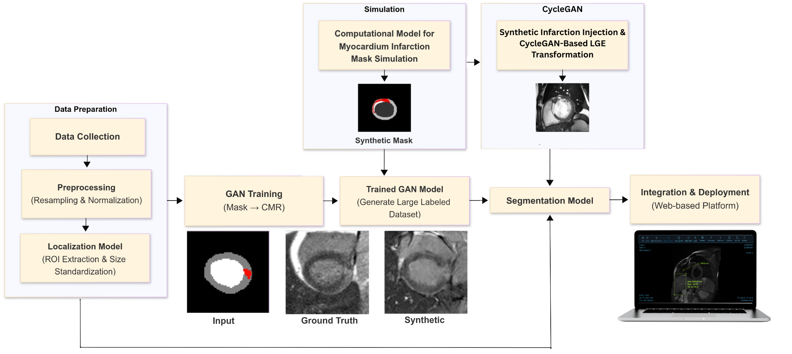

# Web-Based Cardiac Delayed Enhanced MRI Segmentation Using Deep Learning and Synthetic Data Augmentation

[](https://opensource.org/licenses/MIT)
[](https://www.python.org/downloads/)
[](https://tensorflow.org/)
[](https://reactjs.org/)

## Project Overview

This project tackles two fundamental challenges in medical AI: data scarcity and clinical integration. We developed a comprehensive system that uses Generative Adversarial Networks (GANs) to synthesize realistic cardiac MRI data, significantly improving segmentation accuracy for myocardial infarction detection. Our solution includes a fully functional web-based platform that seamlessly integrates AI-powered analysis into the daily workflow of medical professionals.

The core innovation lies in addressing the critical shortage of annotated cardiac MRI data through advanced synthetic data generation, while providing clinicians with an intuitive interface for reviewing, refining, and utilizing AI-generated segmentations in their diagnostic process.

### Clinical Impact

Cardiovascular disease remains the leading cause of global mortality. Accurate segmentation of myocardial infarction is crucial for:
- **Diagnosis and Treatment Planning**: Precise identification of infarcted tissue
- **Therapeutic Guidance**: Essential for procedures like ventricular tachycardia ablation
- **Clinical Decision Support**: Standardized, reproducible analysis for optimal patient care

### Technical Innovation

Our approach addresses critical challenges in medical AI:
- **Data Scarcity**: Novel synthetic data generation using GANs and mathematical simulation
- **Class Imbalance**: Advanced loss functions and attention mechanisms
- **Clinical Integration**: Web-based DICOM viewer with interactive segmentation refinement

## System Architecture



*Complete system workflow from data preprocessing through synthetic data generation to clinical deployment*


## Inter-Component Communication
The system operates as a cohesive pipeline where each component feeds into the next:
1. Preprocessed real data trains the initial GAN models
2. The mathematical simulator generates diverse synthetic masks
3. Trained GANs convert synthetic masks into realistic images
4. Combined real and synthetic data trains robust segmentation models
5. The web platform deploys trained models for clinical use

This integrated approach ensures that improvements in any component benefit the entire system, creating a robust solution for clinical cardiac MRI analysis.

## System Components and Workflow

Our integrated pipeline consists of five interconnected modules that work together to deliver robust cardiac MRI segmentation:

### 1. [Data Preprocessing Pipeline](/Code/Data_Preprocessing/)
The system begins with the EMIDEC dataset containing 100 cardiac MRI cases. Raw DICOM images undergo spatial normalization to ensure consistent 1×1×1 mm³ voxel spacing. A specialized localization network identifies and extracts 128×128 regions of interest centered on the left ventricle, reducing computational complexity while maintaining clinical relevance.

### 2. [Mathematical Simulator](/Code/Data_Simulation_Pipeline/)
This innovative component generates diverse synthetic segmentation masks using three complementary strategies:
- **Fully Synthetic Generation**: Creates physiologically realistic myocardium shapes with embedded infarction patterns
- **Hybrid Injection**: Combines real myocardial anatomy with synthetically generated pathology
- **Cross-Subject Fusion**: Transfers infarction patterns between different patients using k-nearest neighbor matching

The simulator produces thousands of realistic mask variations, dramatically expanding the training dataset beyond the original 100 cases.

### 3. [GAN-Based Image Synthesis](/Code/GANs/)
Two specialized GAN architectures transform synthetic masks into realistic cardiac MRI images:

**Pix2Pix Network**: Performs conditional image-to-image translation from segmentation masks to realistic DE-MRI images. Our custom implementation uses weighted loss functions to address severe class imbalance, ensuring proper representation of rare pathological regions.

**CycleGAN Network**: Enables domain adaptation between cine MRI (abundant but lacking pathology) and LGE sequences (rare but showing infarctions). This allows us to leverage larger datasets of normal cardiac images.

### 4. [Segmentation Models](/Code/Segmentation/)
The enhanced dataset trains two complementary segmentation architectures:
- **Attention Residual U-Net**: Custom architecture with attention gates that focus on clinically relevant regions
- **nnU-Net**: State-of-the-art medical segmentation framework adapted for cardiac pathology detection

Both models benefit from the expanded synthetic dataset, showing particular improvement in detecting rare pathological classes like no-reflow regions.

### 5. [Clinical Web Platform](/Code/Web_Platform/)
The final component integrates all AI models into a production-ready web application. Built with React and Django, it provides:
- Native DICOM file handling and visualization
- Real-time AI inference with interactive overlay display
- Brush-based editing tools for manual refinement
- Automated clinical reporting with quantitative metrics

## Repository Structure

```
GP_InfDE/
├── Code/
│   ├── Data_Preprocessing/          # Image acquisition and preprocessing 
│   ├── Data_Simulation_Pipeline/    # Mathematical simulator for data generation
│   ├── GANs/                       # Pix2Pix and CycleGAN implementations
│   ├── Segmentation/               # U-Net models and training scripts
│   └── Web_Platform/                   # React-based DICOM viewer
├── Assets/                          # Documentation and Images
└── requirements.txt               #  Dependencies
```

## Installation and Setup

For detailed installation and setup instructions, please refer to the individual README files in each component directory:
- [Data Preprocessing Setup](Code/Data_Preprocessing/README.md)
- [Web Platform Setup](Web_Platform/README.md)

## Results and Performance

### Segmentation Performance (Dice Score)

| Class | Real Data Only | Real + GAN Data | Improvement |
|-------|----------------|-----------------|-------------|
| Background | 0.9891 | 0.9881 | -0.10% |
| LV Cavity | 0.9350 | 0.9365 | +0.16% |
| Normal Myocardium | 0.8222 | 0.8119 | -1.25% |
| **Infarcted Myocardium** | **0.6126** | **0.6165** | **+0.64%** |
| **No-Reflow Area** | **0.5376** | **0.6076** | **+13.02%** |
| **Mean Dice Score** | **0.7793** | **0.7921** | **+1.64%** |

### GAN Model Development and Optimization

Our GAN development involved extensive experimentation to achieve optimal performance. The following table shows our iterative improvement process:

#### Pix2Pix Model Trials and Configurations

| Trial | Key Changes | FID ↓ | IS ↑ | LPIPS ↓ | PSNR ↑ |
|-------|-------------|-------|------|---------|--------|
| 1 | Baseline Pix2Pix, tanh, no weighting, default U-Net + PatchGAN | 512.4 | 1.32 | 0.682 | 10.3 |
| 2 | Baseline Pix2Pix, sigmoid, no weighting | 505.8 | 1.45 | 0.68 | 11.7 |
| 3 | Weighted L1 loss, λ = 60, sigmoid, 7/6 layers | 423.9 | 1.75 | 0.598 | 11.4 |
| 4 | Weighted L1 loss, λ = 70, tanh, 7/6 layers, deeper discriminator | 420.2 | 1.77 | 0.599 | 11.2 |
| 5 | Weighted L1 loss, λ = 80, sigmoid, deeper discriminator, noise to BG | 487.8 | 1.53 | 0.643 | 10.8 |
| 6 | λ = 90, sigmoid, instance norm, input mask removed from discriminator | 348.4 | 1.68 | 0.581 | 15.3 |
| 7 | λ = 110, tanh, added dropout, deeper U-Net | 317.3 | 1.66 | 0.588 | 15.9 |
| 8 | λ = 70, tanh, 6/5 layers, shallow discriminator | 310.4 | 1.71 | 0.572 | 14.4 |
| 9 | λ = 100, tanh, 6/5 layers, mask-only discriminator | 224.2 | 1.83 | 0.566 | 15.5 |
| **10** | **Final: λ = 100, tanh, 6/5 layers, weighted L1, dropout, standard PatchGAN discriminator (input + target, not very deep, outputs (30,30,1))** | **198.15** | **2.192** | **0.5382** | **16.42** |

### Comparison with Existing GAN-Based Methods

Our final model demonstrates superior performance compared to existing approaches in the literature:

| Model | FID ↓ | IS ↑ | PSNR ↑ |
|-------|-------|------|--------|
| CycleGAN | 262.6 | 1.112 | 32.4 |
| Pix2Pix | 244.4 | 1.714 | 30.5 |
| U-Net++ Pix2Pix | 201.1 | 1.747 | - |
| Differential P2P | 244.3 | 1.885 | - |
| Joint Model | 206.3 | 1.737 | - |
| **Our Model** | **198.15** | **2.192** | **16.42** |

*Note: While our PSNR is lower due to the complexity of DE-MRI images, our model excels in perceptual quality metrics (FID, IS) which are more relevant for medical image synthesis.*

### Key Achievements

- ✅ **13% improvement** in no-reflow region segmentation
- ✅ **61% reduction** in FID score for synthetic image quality
- ✅ **66% increase** in Inception Score for image diversity
- ✅ **Web-based platform** for clinical integration
- ✅ **Best-in-class performance** compared to existing GAN methods

## System Demonstration


*Watch our comprehensive demonstration showing the complete workflow from DICOM upload to AI-powered segmentation and clinical reporting*

## Published Research

This project has resulted in comprehensive research documentation:

### Paper
- **"Web-Based Cardiac Delayed Enhanced MRI Segmentation Using Deep Learning and Synthetic Data Augmentation"**  
[📄 Paper PDF](assets/Web-Based_Cardiac_Delayed_Enhanced_MRI_Segmentation_Using_Deep_Learning_and_Synthetic_Data_Augmentation.pdf)
## Research Contributions

### Novel Methodologies
1. **Mathematical Simulation Framework**: Novel approach for generating realistic cardiac pathology patterns
2. **Hybrid GAN Architecture**: Innovative combination of Pix2Pix and CycleGAN for medical image synthesis
3. **Clinical Integration Platform**: Comprehensive web-based system for AI-powered cardiac MRI analysis
4. **Performance Validation**: Thorough evaluation on EMIDEC dataset with clinical relevance metrics

### Impact and Significance
- **Clinical Workflow Integration**: Bridges the gap between AI research and clinical practice
- **Data Scarcity Solution**: Addresses fundamental challenge in medical AI through synthetic data generation
- **Performance Enhancement**: Demonstrates significant improvement in rare class segmentation (13% for no-reflow regions)

## Citation

If you use this work in your research, please cite:

```bibtex
@article{cardiac_segmentation_2025,
  title={Web-Based Cardiac Delayed Enhanced MRI Segmentation Using Deep Learning and Synthetic Data Augmentation},
  author={Omar N. and Omar E. and Khaled M. and Hana H. and Khaled A. and Ahmed A. and Tamer B.},
  journal={Graduation Project},
  year={2025},
  institution={Cairo University, Faculty of Engineering}
}
```

## Acknowledgments

- **EMIDEC Challenge**: For providing the cardiac MRI dataset
- **Cairo University**: Systems and Biomedical Engineering Department
- **NIH NIDDK**: Biomedical and Metabolic Imaging Branch collaboration
- **Open Source Community**: TensorFlow, React, and medical imaging libraries

## Contact

- ## Project Team

Meet our dedicated development team working on this graduation project:

<div align="center">

<table>
  <tr>
    <td align="center">
      <div style="text-align:center; margin-right:20px;">
        <a href="https://github.com/OmarEmad101">
          
          <br>
          <sub><b>Omar Emad</b></sub>
        </a>
      </div>
    </td>
    <td align="center">
      <div style="text-align:center; margin-right:20px;">
        <a href="https://github.com/Omarnbl">
          
          <br>
          <sub><b>Omar Nabil</b></sub>
        </a>
      </div>
    </td>
    <td align="center">
      <div style="text-align:center; margin-right:20px;">
        <a href="https://github.com/KhaledBadr07">
          
          <br>
          <sub><b>Khaled Badr</b></sub>
        </a>
      </div>
    </td>
    <td align="center">
      <div style="text-align:center; margin-right:20px;">
        <a href="https://github.com/hanaheshamm">
          
          <br>
          <sub><b>Hana Hesham</b></sub>
        </a>
      </div>
    </td>
  </tr>
</table>

</div>

- **Institution**: Cairo University, Faculty of Engineering

---

**⭐ Star this repository if you find it helpful!**

For questions, issues, or collaboration opportunities, please open an issue or contact the development team.
```

